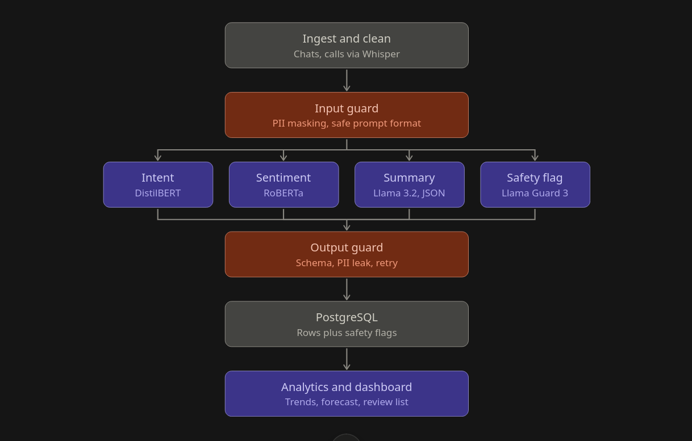

# convoiq

A contact-center conversation intelligence platform: it takes raw customer interactions (chat, email,
call audio), labels them with intent / sentiment / entities / summary, stores them in SQL, and turns
the aggregate into trends, forecasts and operational dashboards.

> **Project status: Day 1 in progress. Most of this is still a design target.**
> What exists today: build configuration, the `src/` package, the Banking77 loader, and a
> prompted-LLM intent baseline that has only been smoke-tested. There are no trained models and no
> API. Everything described below under [Architecture](#architecture), [Planned API](#planned-api)
> and [Roadmap](#roadmap) is a **design target, not a description of working software**. See the
> [status table](#status) for what actually exists. Sections are updated as work lands.

---

## Status

| Component | State |
| --- | --- |
| Repo scaffold (`pyproject.toml`, `Makefile`, `uv.lock`, `AGENTS.md`) | done |
| Dependency groups declared and installable | done |
| Ollama models pulled and verified | done |
| Banking77 loader (`loaders/banking77.py`) | done |
| `src/` package with prompted-LLM intent baseline | done, smoke-tested only |
| Real baseline run (300 messages, plain vs constrained) | not started |
| Fine-tuned intent classifier | not started |
| Sentiment analysis | not started |
| PII masking / guardrails | not started |
| `POST /analyze` API | not started |
| PostgreSQL schema + batch pipeline | not started |
| Analytics (trends, topics, forecast) | not started |
| A/B test + escalation model | not started |
| BI dashboard | not started |
| Evaluation report | not started |
| Automated tests | not started |

`make baseline` runs the prompted-LLM baseline (default 300 sampled test messages, `--constrained`
forces label-constrained decoding). It has been smoke-tested on 3 messages but **no full run or
evaluation has been done yet**. `make api` still fails — there is no `src/api.py` until the
FastAPI stage.

---

## The problem

A bank or telecom receives thousands of calls, chats and emails a day. Nobody reads or listens to all
of them, so nobody knows why customers are calling, how they feel, which issues are growing, or which
customers are about to escalate.

Given a single interaction —

> "My card got blocked while I was traveling and nobody is helping me, this is the third time I'm
> calling!"

— the platform should classify the intent (`card_blocked`), detect sentiment (angry, repeat contact,
high risk), extract structured fields, summarise it, and route or draft a reply. Across thousands of
interactions, that becomes a dashboard showing which issues are spiking, which segments are
escalating, and next week's expected volume.

---

## Architecture



The design is a linear pipeline with one fan-out and one fan-in:

1. **Ingest and clean** — normalise, deduplicate, split into customer/agent turns. Audio is
   transcribed with `faster-whisper`.
2. **Input guard** — PII masking (Microsoft Presidio) and a safe prompt format, before anything is
   sent to a model.
3. **Four parallel branches**
   - **Intent** — fine-tuned DistilBERT classifier.
   - **Sentiment** — RoBERTa sentiment model.
   - **Summary + extraction** — Llama 3.2 emitting structured JSON.
   - **Safety flag** — Llama Guard 3, flagging unsafe or adversarial input.
4. **Output guard** — schema validation, PII-leak check on the generated text, and retry on
   invalid output.
5. **PostgreSQL** — one row per conversation, including the safety flags.
6. **Analytics and dashboard** — trends, forecast, and a human review list.

The orchestration is plain `asyncio`. The pipeline is deterministic and has no cyclic or stateful
branching, so a graph framework would add cost without benefit.

> **Guardrails are first-class, not an afterthought.** Input masking, output validation, a dedicated
> safety classifier and prompt-injection testing are part of the core design, and are evaluated
> quantitatively (PII leak rate, injection success rate).

---

## Tech stack

Chosen to run entirely locally and on free/open-source tooling.

| Layer | Choice |
| --- | --- |
| Language | Python 3.11 (`uv`-managed) |
| API | FastAPI + Pydantic v2 |
| Data | pandas, scikit-learn, Hugging Face `datasets` |
| LLM | Ollama (OpenAI-compatible API) |
| Intent model | DistilBERT, optionally LoRA via PEFT |
| Sentiment | `cardiffnlp/twitter-roberta-base-sentiment-latest` |
| PII | Microsoft Presidio + spaCy |
| Embeddings / topics | `nomic-embed-text`, sentence-transformers, BERTopic |
| Storage | PostgreSQL + SQLAlchemy (SQLite for early development) |
| Stats | SciPy, statsmodels, LightGBM |
| Observability | Arize Phoenix, prometheus-fastapi-instrumentator |
| Dashboard | Power BI or Tableau |
| Packaging | Docker Compose |

**Multi-provider design.** All model access goes through one provider interface so the backend can be
swapped by changing configuration. Only Ollama is actually used here — see
[Honest limitations](#honest-limitations).

---

## Quickstart

Requires [uv](https://docs.astral.sh/uv/) and Python 3.11.

```bash
git clone <your-fork-url>
cd convoIQ
make setup          # base install, dev tools only
make check-ollama   # verify the required local models are present
```

`make setup` installs only the `dev` group by default. Everything else is opt-in, because the heavy
groups are large and are needed only at later stages:

```bash
make setup-ml       # torch, transformers, accelerate   (Day 2: fine-tuning)
make setup-guard    # presidio, spacy                   (Day 4: guardrails)
```

Three groups have **no Makefile target**; install them directly when you reach them:

```bash
uv sync --group analytics   # statsmodels, lightgbm, bertopic, sentence-transformers
uv sync --group db          # sqlalchemy, psycopg
uv sync --group obs         # arize-phoenix, prometheus-fastapi-instrumentator
```

### GPU

Development happens on a single **RTX 3050 with 6GB VRAM**. Ollama keeps models resident in VRAM, so
unload them before any training or heavy inference or you will OOM:

```bash
make free-gpu
```

### Daily commands

```bash
make lint    # ruff check + ruff format check
make test    # pytest
make help    # list every target
```

Run a single test with:

```bash
uv run pytest path/to/test_file.py::test_name
```

Async tests need no `@pytest.mark.asyncio` decorator — `asyncio_mode` is set to `auto`.

---

## Local models

`make check-ollama` requires these three models:

| Model | Role |
| --- | --- |
| `llama3.2:3b` | Summarisation, extraction, structured JSON output, prompted baseline |
| `llama-guard3:1b` | Safety / prompt-injection classification |
| `nomic-embed-text` | Embeddings for BERTopic topic discovery |

`qwen3.5:0.8b` is also used as a second prompted baseline on Day 1, for comparison against
`llama3.2:3b`.

---

## Datasets

Two public datasets are used, for **different** purposes. This distinction matters and is easy to get
wrong:

| Dataset | Used for | Important caveat |
| --- | --- | --- |
| **Banking77** | Intent classification (77 classes) | **Contains single utterances, not multi-turn conversations.** It is an intent dataset, not a conversation dataset, and is never presented as one. |
| **Twitter Customer Support (`twcs`)** | Conversation threads, sentiment, realistic multi-turn support dialogues | Twitter-domain language, not voice contact-centre audio. |

Both are loaded through Hugging Face `datasets` and split into train/validation/test before any
training.

Two operational notes on Banking77:

- **The canonical `PolyAI/banking77` repo no longer loads.** Hugging Face removed support for
  script-based datasets, so it fails with `Dataset scripts are no longer supported`. The loader falls
  back to `mteb/banking77`, which works. That fallback is the only working path today, not a rare
  escape hatch.
- **Row counts differ slightly from the published dataset** — 9,993 train / 3,076 test here, versus
  the commonly cited 10,003 / 3,080. Scores therefore will not match published Banking77 numbers
  exactly; any comparison should state which snapshot was used.

---

## Planned API

Not implemented yet. The intended contract for the demo endpoint:

`POST /analyze`

```json
{
  "conversation": "My card got blocked while I was traveling and this is the third time I'm calling."
}
```

```json
{
  "intent": "card_blocked",
  "sentiment": "angry",
  "sentiment_score": 0.94,
  "summary": "Customer's card was blocked while travelling; they have contacted support three times.",
  "repeat_contact": true,
  "resolved": false,
  "priority": "high",
  "safety_flag": false,
  "suggested_action": "Escalate to senior support agent."
}
```

Responses are Pydantic models, so the schema is enforced on the way out as well as on the way in.

---

## Roadmap

Fourteen days, tracked in `docs/timeline.png`. The critical path is
`0 → 1 → 2 → 5 → 7 → 8 → 10`, running alongside an equally long `0 → 3 → 4 → 5` chain — so the
fine-tuning branch and the sentiment/guardrail branch are both load-bearing and neither can slip.
Day 11 (evaluation) blocks nothing except the Day 12 write-up, so it is the one day that can move.

| Day | Work | Depends on |
| --- | --- | --- |
| 0 | Setup: uv, Makefile, verify Ollama, load Banking77 and `twcs` | — |
| 1 | Prompted intent baseline (`llama3.2:3b` vs `qwen3.5:0.8b`), macro F1 | 0 |
| 2 | Fine-tune DistilBERT on GPU (`make free-gpu` first), compare to baseline | 1 |
| 3 | Sentiment model, extraction prompt and schema | 0, parallel with 2 |
| 4 | Guardrails: Presidio, safe prompt format, red-team set, Llama Guard branch, output checks | 3 |
| 5 | Async `analyze_one` with all four branches and retries | 2, 3, 4 |
| 6 | FastAPI `/analyze` plus Phoenix tracing | 5 |
| 7 | PostgreSQL and batch processing | 5 |
| 8 | Analytics: BERTopic with `nomic-embed-text`, forecasting | 7 |
| 9 | Simulated A/B test and LightGBM escalation model | 7 |
| 10 | Dashboard | 8, 9 |
| 11 | Evaluation: LLM judge, guardrail metrics, latency and cost | 6, 7 |
| 12 | Docker Compose, README, diagrams | all |
| 13 | Buffer and interview rehearsal | — |

---

## Evaluation

Evaluation is the part that makes the work defensible, so it is **never cut** for time. If the schedule
slips, features are dropped in this order:

```
drift detection → Grafana → LightGBM → Whisper
```

**Classification metrics.** Banking77 has 77 intent classes and is heavily imbalanced, so **both micro
and macro F1 are always reported** — never accuracy alone. Macro F1 is the metric that reflects
per-class performance; micro F1 reflects overall example-weighted performance.

**Model comparison.** The fine-tuned DistilBERT classifier and the prompted LLM are compared on
accuracy, F1, latency, cost per 1K conversations, and infrastructure footprint — with real numbers, not
opinions.

**Guardrail metrics.** PII leak rate and prompt-injection success rate, measured against a
hand-built red-team set.

**Latency.** Reported as p50 and p95, not mean. A mean hides the slow tail that real users
experience.

**LLM-as-a-judge.** A sample of conversations is labelled by both the judge and a human, and the two
are compared, so the automated evaluator's own reliability is measured rather than assumed.

---

## Honest limitations

Stated up front, because a project that overstates itself is worth less than one that doesn't.

- **The bot-vs-human A/B test is simulated.** No public dataset contains controlled bot-vs-human
  customer-support outcomes with real resolution results. The experiment is labelled as simulated
  wherever it appears, with its assumptions documented. It is not a production A/B result.
- **Only Ollama is used.** The provider abstraction is designed so Azure OpenAI or Vertex AI could be
  swapped in by changing configuration, but **neither has been used**. The claim is "the abstraction
  exists", not "we ran on Azure".
- **Banking77 is not a conversation dataset.** It contains individual utterances. Multi-turn
  conversation work uses `twcs` instead.
- **Out of scope entirely:** KV cache tuning, horizontal pod autoscaling, and LangGraph state
  management. None of these are implemented, and none should be claimed.
- **The evaluation judge model needs revisiting.** The design calls for `gemma4:e4b` as the
  LLM-as-a-judge, but that model is ~9.6GB and **does not fit in this machine's 6GB VRAM**. It needs
  CPU offload, quantisation, or substitution with a smaller judge. This is an open decision, not a
  solved one.
- **Chat and email are not voice.** Only call audio goes through Whisper, and the transcription path
  is last in the build order — it is the first thing cut if time runs short.

---

## Project layout

```
convoIQ/
├── AGENTS.md              # conventions and gotchas for coding agents
├── Makefile               # every workflow entrypoint
├── pyproject.toml         # deps, staged into per-day dependency groups
├── src/
│   ├── __init__.py
│   ├── baseline.py        # Day 1: prompted-LLM intent baseline
│   ├── config.py          # settings from env / .env
│   ├── explore_dataset.py # dataset EDA + class distribution chart
│   └── inspect.py         # eyeball rows and class balance
├── loaders/
│   └── banking77.py       # Banking77 loader
├── results/               # output; gitignored
└── docs/
    ├── arch.png           # pipeline diagram
    ├── timeline.png       # day-by-day plan and dependencies
    └── mine/              # design spec (local working notes, gitignored)
```

The project is configured with `package = false`, so it is never pip-installed. Modules resolve because
`uv run` places the repository root on `sys.path` — which is why `src/` must sit at the repo root and
not be nested further.

The loader lives in `loaders/`, **not** a directory called `datasets/`. The installed HuggingFace
`datasets` package is a regular package, and a regular package always wins over a local directory of
the same name — so `from datasets.banking77 import ...` would fail, and adding an `__init__.py` would
break the loader's own `from datasets import load_dataset`.

---

## Development notes

- **Dependencies are staged by day on purpose.** Only sync the group the current step needs;
  `make setup-all` up front wastes time and disk.
- **`uv run` re-locks `uv.lock`.** The committed lockfile predates several of the dependency groups,
  so the first `uv run` rewrites it with a very large diff. That is expected — keep it out of
  unrelated commits.
- **Linting covers Markdown.** `make lint` also format-checks Python code blocks inside `.md` files,
  including this one. Run `uv run ruff format .` rather than hand-fixing.
- **No CI, no pre-commit, no typechecker** are configured yet.

More detail on conventions and environment quirks lives in [`AGENTS.md`](AGENTS.md).
